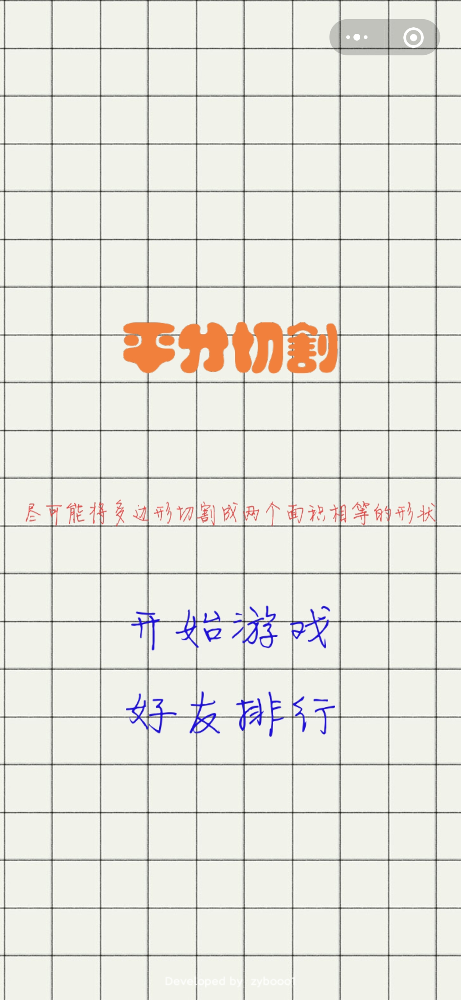
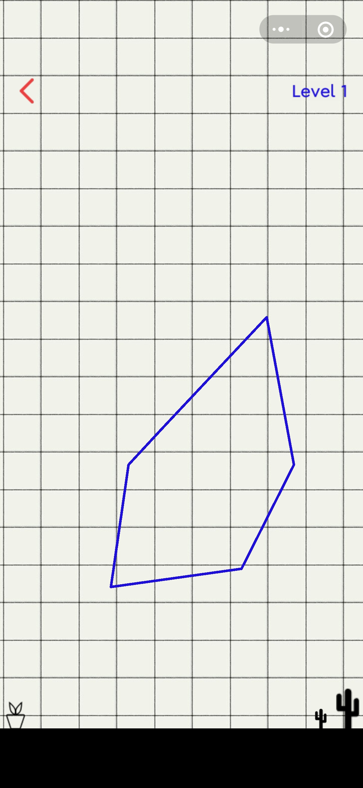
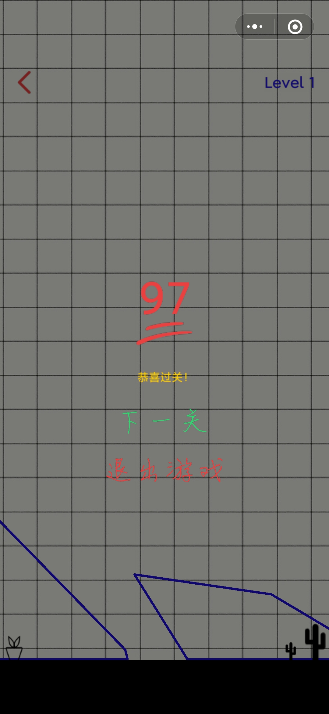
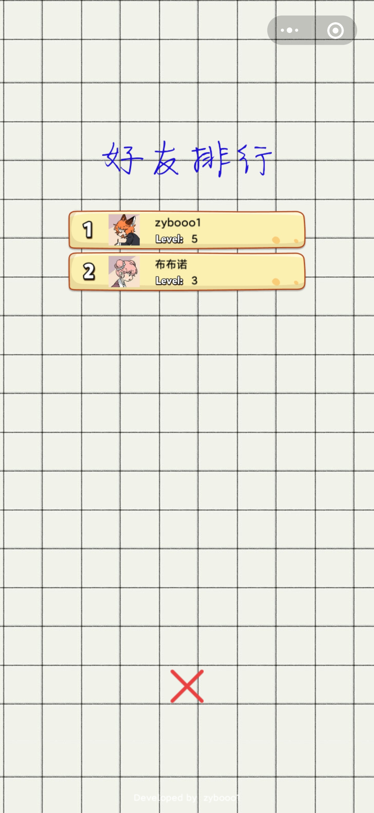

# CutGame 平分切割
基于CocosCreator2.4.4开发的微信小游戏

#### 微信扫一扫体验

#### 项目结构
Cut目录为主工程，CutOpenDataDomain为微信开放数据域（好友排行）工程。
参考CocosCreator[接入微信小游戏的开放数据域](http://docs.cocos.com/creator/manual/zh/publish/publish-wechatgame-sub-domain.html)

#### 游戏截图
   
